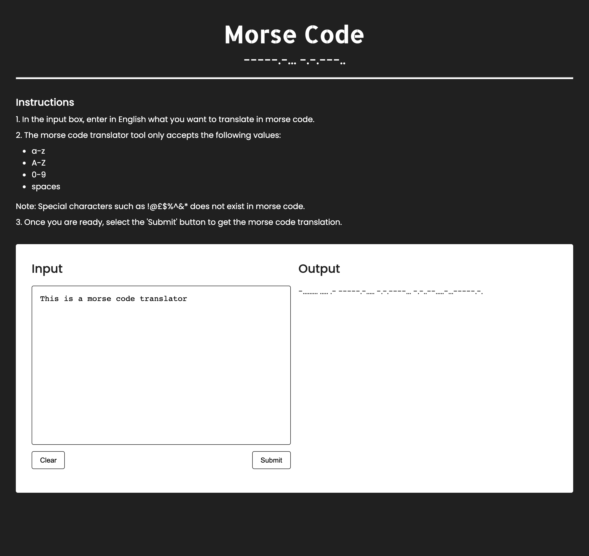

# TOOLS MORSE

### Overview
A Javascript based morse code tool to translate English into morse code.

### 1. Project's objective
To develop a tool using a test driven development (TDD) where tests are developed before functionalities.

### 2. Design and layout
A screen showing the header, instructions, input in English and output in morse code.

### 3. Technical development

#### 3.1 Technologies
- HTML/HTML5
- CSS/SCSS
- Javascript
- JEST
- Babel
- NPM
- IDE PHP Storm

#### 3.2 HTML/HTML5
- Uses HTML5 standards i.e. header, main and section.

#### 3.3 CSS/SCSS
- The SCSS uses or includes the following:
    - atomic design methodology, and
    - B.E.M methodology for naming classes.

#### 3.4 Javascript
- Functionalities include:
    - validating the input in English i.e only allow a-z, A-Z and 0-9,
    - sanitising the input in English i.e. to lower case for A-Z,
    - splitting words to allow for looping over the object containing the morse code, and
    - converting the sanitised input into morse code.

#### 3.5 JEST
- Uses TDD to develop the tool before functionalities.
- Testing considers different scenarios including:
  - validating inputs i.e. 'ABCDEFG', '!@£$%^&' and 'ABCD%^&', 
  - sanitising inputs i.e. 'A', '1', 'Please', 'Please call NOW',
  - splitting words becomes an array and 'urgent' becomes ["u", "r", "g", "e", "n", "t"], and
  - conversion of English i.e. 'a', '1', 'please' and 'please call now' to morse code.
